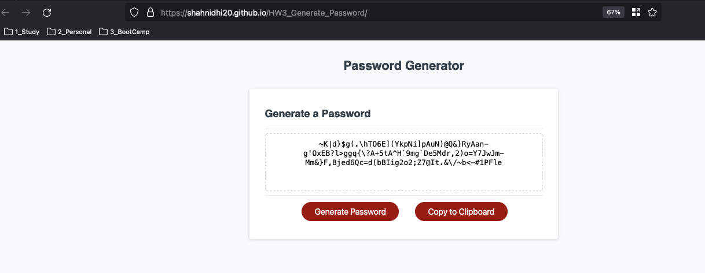

# HomeWork 3 Generate Password

   

     
   

## Description

    *Demonstrates the JS following features
        1. EventListeners
        2. Math Functions
        3. Functions with parameters
        4. Helper methods like alert, prompts, confirm, console

## Getting Started

### Dependencies

NA

### Installing

- Clone the repo

### Executing program

NA

## Help

NA

## Authors

Nidhi Shah

## Version History

    0.1
        Initial Release

## License

NA

## Acknowledgments

    Refered following resources
    https://www.w3schools.com/js/
    https://developer.mozilla.org/en-US/docs/Web/JavaScript
